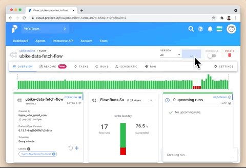
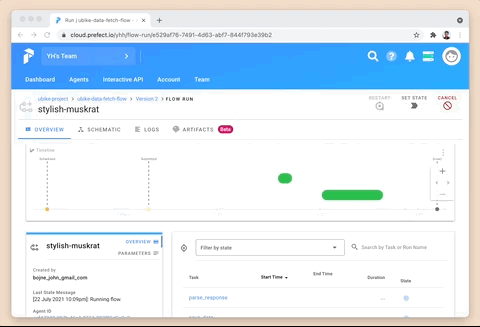
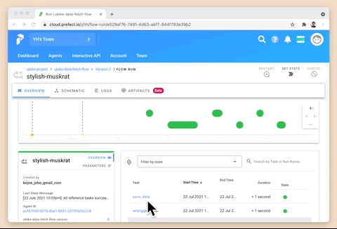
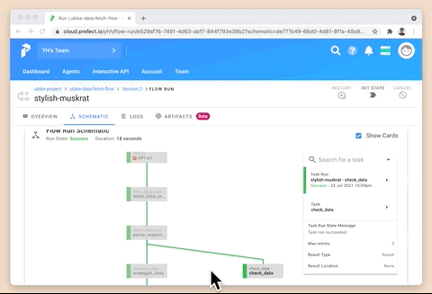

# Prefect Flow Example 
A Prefect flow example that fetch and save bike data from [New Taipei City Open API](https://data.ntpc.gov.tw/datasets/71CD1490-A2DF-4198-BEF1-318479775E8A).

## Prerequisites
Have Python and pip / conda installed.

## Installation 

Installing required packages with Python virtual environment is the best practice to set thing up. You can do it via `pip` or `conda`:
### Install Packages in Python Virtual Environment 
```
pip install virtualenv
python -m venv prefect-flow-example
source activate prefect-flow-example/bin/activate
pip install -r requirements.txt
```

### Conda Virtual Environment
```
conda create -n prefect-flow-example python=3.7
source activate prefect-flow-example
conda config --append channels conda-forge
```

## Usage 
### Runing the Flow with Prefect CLI 
```
prefect run -p flow.py  
```

### Running on Prefect Cloud 
1. Create an free account on [cloud.prefect.io](https://cloud.prefect.io/)
2. Get the API key from the UI 
3. Register your flow with your key  `prefect auth login -k KEY_PLACEHOLDER`
4. Create a Project `prefect create project "ubike-project"`
5. Register your flow `prefect register -p flow.py --project 'ubike-project'`
6. Refresh the cloud and check if your flow is being registered under the project 
7. Set up an local agent `prefect agent local start --key "API_KEY"` 
8. Once your agent is running, go to the cloud UI and click quick run 🚀 

## Prefect Cloud UI Demo

<table>
  <tr>
    <td>Quick Run from the UI</td>
    <td>Realtime Dashboard</td>
   </tr> 
   <tr>
      <td>Code Schematic </td>
      <td>Logging
  </td>
  </tr>
</table>
### Contribution 
- Create an issue for suggestions 
- Fork this repo and submit a PR for contribution

### Project Layout 

TYPE|OBJECT|DESCRIPTION
---|---|---
📄|[flow.py](./flow.py)| The main Prefect flow
📄|[requirements.txt](./requirements.txt)|Python packages required for local development of Prefect Flows in this repository
📄|[README.md](./readme.md)| The doc you're reading 
📁|[frontend](./frontend)| Folder for web app code and assets 
📁|[data_raw](./data_raw)| Folder to save csv data files (created by the flow) 
📁|[test](./test)| Folder for test scripts   
📁|[image](./image)| Folder for images file